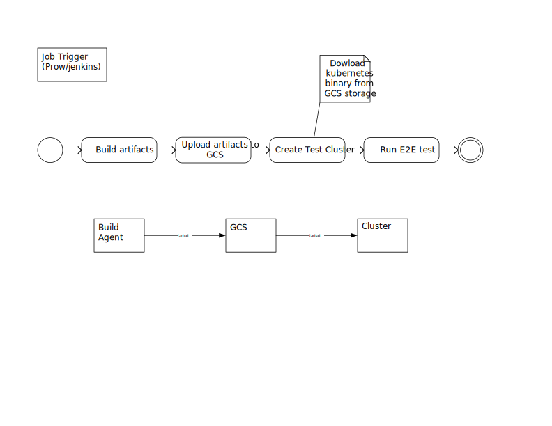
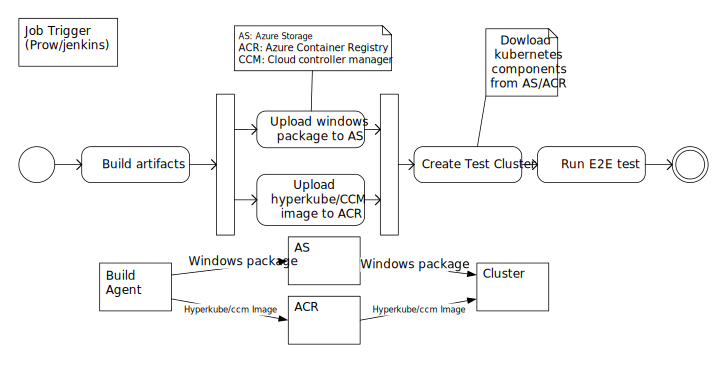

# Acs-engine based kubernetes test design

## Pipeline Summary

1. Existing pipline

Currently running E2E tests on
GCE(based on [scripts](https://github.com/kubernetes/kubernetes/tree/master/cluster/gce)) and AWS (based on [kops](https://github.com/kubernetes/kops)) all support deploying a new cluster based on built binaries. Thus they call all follow the given flow here.

1. Acs-engine pipeline

## Goal

## Working steps
