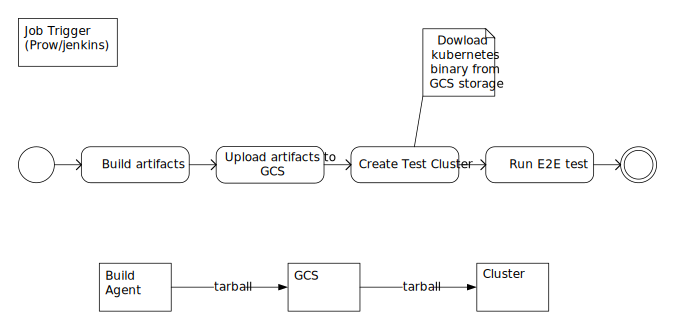

# Acs-engine based kubernetes E2E design draft

## Test Pipeline

1. Existing pipline (GCE, AWS)

    

    Currently running E2E tests on
    GCE(based on [scripts](https://github.com/kubernetes/kubernetes/tree/master/cluster/gce)) and AWS (based on [kops](https://github.com/kubernetes/kops)) all support deploying a new cluster based on built binaries. Thus they call all follow the given flow here.


1. Acs-engine pipeline

    

    Acs-engine supports custom kubernetes packages via [customHyperkubeImage](https://github.com/Azure/acs-engine/blob/v0.16.0/docs/kubernetes/k8s-developers.md) in api model.

    In this case, the previous flow cannot statisfy here.


## Goal
The final goal is:

1. Allows deploying cluster from source code (pull request/branch) to Azure, and running E2E test against the cluster

    The cluster would be deployed to Azure, so that a valid Azure credential is needed. The credential would contain things like 'tenant id', 'service principal id', 'service principal secert', etc.

    After that, any developers could easily set up a testing cluster as long as he provides required Azure credential and required configs.

1. Integrate with [prow](https://github.com/kubernetes/test-infra/tree/master/prow) (kubernetes test infra) to trigger tests

    A vendor organization that sponsors running test on Azure could provide their credential via [CNCF](https://github.com/kubernetes/test-infra/issues/7475#issuecomment-380281811), and later prow could pick up the credential and use it for running test.

    Examples of using those credentials could be found [here](https://github.com/kubernetes/test-infra/blob/master/prow/config.yaml#L276)


## Working steps

1. Support deploying cluster with acs-engine

    Regarding kubetest, it is to support '--up', '--down' option. And this is what [PR76250](https://github.com/kubernetes/test-infra/pull/7625) targets

1. Support uploading build artifacts to azure storage and azure container registry

    Currently kubetest only supports uploading to GCS and GCR.

    The artifacts in GCS is indeed public accessable, but when testing against 100+ nodes, it will cause all the nodes to download the same package from external network. Thus it's better to make the package accessable in a storage account in same Azure region. Same for the container image.

1. Support test run via prow

## Kubetest acsengine deployment module design

### Overview
We already have a linux cluster workflow for running k8s E2E on Azure in [cloud-provider-azure](https://github.com/kubernetes/cloud-provider-azure/blob/master/docs/e2e-tests.md). It involves build and push image, call acs-engine, deploy cluster, and call kubetest to run tests. But after we have integrate acs-engine with kubetest, this could be simplified.

### Template based apimodel
Acs-engine use [apimodel](https://github.com/Azure/acs-engine/blob/master/docs/clusterdefinition.md) to define a cluster, which has a lot of configurations.

For running test, we would support several basic configurations as prototypes, in this case we can provide some built-in template. And leave the credentials as template parameters.


Note:

[kubeBinariesSASURL](https://github.com/Azure/acs-engine/blob/c8654c3b874c15462e25babc7a8e25c2e748d75e/pkg/acsengine/engine.go#L845) is not overridable yet via apimodel. Should add a custom property, here use `WindowsPackageSASURLBase` as example.


For example (click to expand):
- <details><summary>linux_ccm (2 nodes)</summary>

    ```json
    {
        "apiVersion": "vlabs",
        "location": "{{.location}}",
        "properties": {
            "orchestratorProfile": {
                "orchestratorType": "Kubernetes",
                "orchestratorRelease": "1.10",
                "kubernetesConfig": {
                    "useCloudControllerManager": true,
                    "customCcmImage": "{{.customCcmImage}}"
                }
            },
            "masterProfile": {
                "count": 1,
                "vmSize": "Standard_F2",
                "dnsPrefix": "{{.dnsPrefix}}"
            },
            "agentPoolProfiles": [
                {
                    "name": "agentpool1",
                    "count": 2,
                    "vmSize": "Standard_F2",
                    "availabilityProfile": "AvailabilitySet",
                    "storageProfile": "ManagedDisks"
                }
            ],
            "linuxProfile": {
                "adminUsername": "k8s-ci",
                "ssh": {
                    "publicKeys": [
                        {
                            "keyData": "{{.keyData}}"
                        }
                    ]
                }
            },
            "servicePrincipalProfile": {
                "clientID": "{{.clientID}}",
                "secret": "{{.secret}}"
            }
        }
    }
    ```
</details>

- <details><summary>linux_large (100 nodes)</summary>

    ```json
    {
        "apiVersion": "vlabs",
        "location": "{{.location}}",
        "properties": {
            "orchestratorProfile": {
                "orchestratorType": "Kubernetes",
                "orchestratorRelease": "1.10"
            },
            "masterProfile": {
                "count": 5,
                "vmSize": "Standard_F2",
                "dnsPrefix": "{{.dnsPrefix}}"
            },
            "agentPoolProfiles": [
                {
                    "name": "agentpool1",
                    "count": 100,
                    "vmSize": "Standard_F2",
                    "availabilityProfile": "AvailabilitySet",
                    "storageProfile": "ManagedDisks"
                }
            ],
            "linuxProfile": {
                "adminUsername": "k8s-ci",
                "ssh": {
                    "publicKeys": [
                        {
                            "keyData": "{{.keyData}}"
                        }
                    ]
                }
            },
            "servicePrincipalProfile": {
                "clientID": "{{.clientID}}",
                "secret": "{{.secret}}"
            }
        }
    }
    ```
</details>

- <details><summary>windows_basic</summary>

    ```json
    {
        "apiVersion": "vlabs",
        "location": "{{.location}}",
        "properties": {
            "orchestratorProfile": {
                "orchestratorType": "Kubernetes",
                "orchestratorRelease": "1.9",
                "kubernetesConfig": {
                    "useCloudControllerManager": true,
                    "WindowsPackageSASURLBase": "{{.winzipbase}}"
                }
            },
            "masterProfile": {
                "count": 1,
                "vmSize": "Standard_F2",
                "dnsPrefix": "{{.dnsPrefix}}"
            },
            "agentPoolProfiles": [
                {
                    "name": "agentpool1",
                    "count": 2,
                    "vmSize": "Standard_F2",
                    "availabilityProfile": "AvailabilitySet",
                    "storageProfile": "ManagedDisks",
                    "osType": "Windows"
                }
            ],
            "windowsProfile": {
                "adminUsername": "k8s-ci",
                "adminPassword": "{{.adminPassword}}"
            },
            "linuxProfile": {
                "adminUsername": "k8s-ci",
                "ssh": {
                    "publicKeys": [
                        {
                            "keyData": "{{.keyData}}"
                        }
                    ]
                }
            },
            "servicePrincipalProfile": {
                "clientID": "{{.clientID}}",
                "secret": "{{.secret}}"
            }
        }
    }
    ```
</details>

### Kubetest calling acs-engine for creating cluster ARM template

Proposed following new flags for kubetest
```
# template name
--acsengine-apimodel-template
# static configs read from file, usually credentials
--acsengine-apimodel-config-file
# dynamic key value pairs from command line, such as location, hyperkube image location
--acsengine-apimodel-configs
```

An example of config file
```
tenant_id=
client_id=
client_secret=
ssh_public_key=
# For windows
admin_password=
```

### kubetest calling az cli for deploying ARM template

Instead of call ARM apis in kubetest, it should call 'az' cli to doe deployment.

Existing example of calling [gcloud](https://github.com/kubernetes/test-infra/blob/master/kubetest/gke.go#L341) and [kops](https://github.com/kubernetes/test-infra/blob/master/kubetest/kops.go#L404).


This has some advantages:

- It is easyto  make use of variaous auth method az cli supports.

  A local develop can use the device token auth, while an auto CI run could use service principal auth.
- It is easy to integrate with other azure cloud service.

  For example, if we are to upload image to acr, az cli could help do the docker auth


TBD: Find ways for initial 'az login', using environment variable?

An example of final execution:
```
kubetest --deployment=acsengine --provider=azure \
  --cluster=<resource-group-name> \
  --acsengine-apimodel-template=linux_ccm \
  --acsengine-apimodel-config-file=<path> \
  --acsengine-apimodel-configs='location=westus2,hyperkube_image=some.io/hyperkube:111' \
  --up --test --down --test_args='--ginkgo.focus="<testpattern>"'
```

### Kubetest uploading artifacts to azure cloud
TBD

